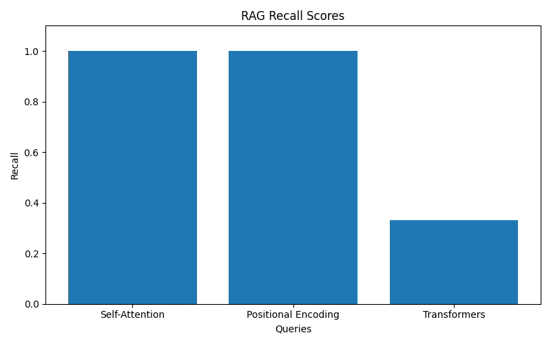

# DeepContext AI

> Production-style Retrieval-Augmented Generation (RAG) platform with hybrid retrieval, reranking, evaluation pipelines, observability, and streaming AI responses.

---

# Overview

DeepContext AI is an enterprise-style RAG platform built using FastAPI, Qdrant, Groq LLMs, and modern retrieval pipelines.

The system enables users to:

- Upload documents
- Generate embeddings
- Perform semantic + keyword hybrid retrieval
- Rerank retrieved chunks using cross-encoders
- Ask grounded questions over documents
- Stream AI responses in real time
- Evaluate retrieval quality using measurable metrics

Unlike beginner RAG demos, DeepContext AI includes:

- hybrid retrieval
- reranking
- structured logging
- evaluation benchmarking
- session-aware retrieval
- observability metrics
- production-style architecture

---

# Features

## Document Processing

- PDF / DOCX / TXT ingestion
- Intelligent chunking
- Embedding generation
- Vector storage in Qdrant

## Retrieval Pipeline

- Semantic vector search
- Keyword-based retrieval
- Hybrid scoring
- Cross-encoder reranking
- Session-specific document filtering

## AI Generation

- Grounded RAG responses
- Streaming generation
- Source attribution
- Context-aware prompting

## Evaluation System

- Recall metrics
- Context relevance scoring
- Latency benchmarking
- Evaluation visualizations

## Observability

- Structured JSON logging
- Retrieval latency tracking
- LLM latency tracking
- End-to-end pipeline timing

---

# Architecture

```text
User Query
    │
    ▼
FastAPI Routes
    │
    ▼
RAG Service
    │
    ├── Hybrid Search
    │      ├── Semantic Search (Qdrant)
    │      └── Keyword Scoring
    │
    ├── Cross-Encoder Reranker
    │
    ├── Prompt Builder
    │
    └── Groq LLM
            │
            ▼
      Streaming Response
```

---

# Tech Stack

| Component | Technology |
|---|---|
| Backend | FastAPI |
| Vector Database | Qdrant |
| Embeddings | BAAI/bge-large-en-v1.5 |
| Reranker | cross-encoder/ms-marco-MiniLM-L-6-v2 |
| LLM | Groq Llama 3.3 70B |
| ORM | SQLAlchemy |
| Database | SQLite |
| Logging | structlog |
| Visualization | matplotlib |
| Async Runtime | asyncio |

---

# Retrieval Pipeline

## 1. Document Ingestion

Uploaded documents are:

- parsed
- chunked
- embedded
- stored in Qdrant

## 2. Hybrid Retrieval

The system combines:

- vector similarity search
- keyword frequency scoring

to improve retrieval robustness.

## 3. Cross-Encoder Reranking

Retrieved chunks are reranked using a cross-encoder model to improve contextual relevance.

## 4. Prompt Construction

Relevant chunks are formatted with source attribution:

```text
[Source: transformers.pdf | Chunk 4]
```

## 5. Grounded Generation

The LLM answers ONLY using retrieved context.

---

# Evaluation Metrics

DeepContext AI includes a custom RAG evaluation pipeline.

## Metrics

| Metric | Description |
|---|---|
| Recall | Measures concept coverage in generated answers |
| Relevance | Measures contextual quality of retrieved chunks |
| Latency | Measures end-to-end response time |

---

# Benchmark Results

| Metric | Score |
|---|---|
| Average Recall | 0.78 |
| Average Relevance | 1.00 |
| Average Latency | 2.35s |

---

# Example Evaluation Output

```text
Question: What is self-attention?
Recall: 1.00
Relevance: 1.00
Latency: 2.85s

Question: Difference between positional encoding and self-attention
Recall: 1.00
Relevance: 1.00
Latency: 2.27s

Question: What are transformers?
Recall: 0.33
Relevance: 1.00
Latency: 1.94s
```

---

# Structured Logging Example

```json
{
  "session_id": "evaluation",
  "retrieval_time": 0.74,
  "chunks_retrieved": 5,
  "event": "Retrieval completed"
}
```

---

# API Endpoints

## Upload Documents

```http
POST /api/v1/upload
```

## Ask Questions

```http
POST /api/v1/ask
```

## Streaming Responses

```http
POST /api/v1/ask/stream
```

## Semantic Search

```http
GET /api/v1/search
```

## Sessions

```http
POST /api/v1/sessions/create
```

---

# Project Structure

```text
app/
├── api/
│   ├── dependencies.py
│   └── routes/
│       ├── classify.py
│       ├── documents.py
│       ├── health.py
│       ├── rag.py
│       ├── search.py
│       ├── sessions.py
│       ├── session_documents.py
│       └── upload.py
│
├── core/
│   ├── config.py
│   ├── logging.py
│   └── chat_memory.py
│
├── db/
│   ├── database.py
│   └── models/
│
├── evaluation/
│   ├── evaluator.py
│   ├── metrics.py
│   ├── visualize.py
│   └── charts/
│
├── prompts/
│   └── rag_prompts.py
│
├── schemas/
│
├── services/
│   ├── document_service.py
│   ├── embedding_service.py
│   ├── hybrid_search_service.py
│   ├── qdrant_service.py
│   ├── rag_service.py
│   ├── reranker_service.py
│   └── session_service.py
│
└── main.py
```

---

# Installation

## Clone Repository

```bash
git clone <repo-url>
cd enterprise_nlp_platform
```

## Create Virtual Environment

```bash
python -m venv venv
```

## Activate Virtual Environment

### Windows

```bash
venv\Scripts\activate
```

### Linux / Mac

```bash
source venv/bin/activate
```

## Install Dependencies

```bash
pip install -r requirements.txt
```

---

# Environment Variables

Create a `.env` file:

```env
GROQ_API_KEY=your_groq_api_key
QDRANT_URL=http://localhost:6333
DATABASE_URL=sqlite+aiosqlite:///./enterprise_nlp.db
```

---

# Run Qdrant

## Docker

```bash
docker run -p 6333:6333 qdrant/qdrant
```

---

# Start API Server

```bash
uvicorn app.main:app --reload
```

Swagger Docs:

```text
http://127.0.0.1:8000/docs
```

---

# Run Evaluation Pipeline

```bash
python -m app.evaluation.evaluator
```

---

# Generate Evaluation Charts

```bash
python -m app.evaluation.visualize
```

Generated charts:

- recall_chart.png
- relevance_chart.png
- latency_chart.png

Location:

```text
app/evaluation/charts/
```

---

# Example Workflow

## 1. Upload Document

```http
POST /api/v1/upload
```

## 2. Create Session

```http
POST /api/v1/sessions/create
```

## 3. Ask Questions

```http
POST /api/v1/ask
```

Example:

```json
{
  "question": "What is self-attention?",
  "session_id": "your_session_id"
}
```

---

# Streaming Responses

DeepContext AI supports streaming LLM responses using FastAPI StreamingResponse.

Endpoint:

```http
POST /api/v1/ask/stream
```

This enables:
- low-latency UX
- token streaming
- real-time responses

---

# Observability

The platform includes structured observability logging:

- retrieval latency
- reranking performance
- LLM latency
- end-to-end request timing
- chunk retrieval metrics

Example logs:

```json
{
  "session_id": "evaluation",
  "retrieval_time": 0.81,
  "llm_time": 1.22,
  "total_time": 2.14,
  "event": "RAG request completed"
}
```

---

# Future Improvements

- Docker Compose deployment
- Redis caching
- PostgreSQL support
- Background workers
- Authentication & RBAC
- OpenTelemetry tracing
- LangSmith integration
- Metrics dashboard
- Multi-user architecture
- Kubernetes deployment

---

# Why This Project Matters

Most beginner RAG applications stop at:

- embedding generation
- vector retrieval
- basic prompting

DeepContext AI goes further by implementing:

- hybrid retrieval
- cross-encoder reranking
- evaluation frameworks
- observability
- latency benchmarking
- production-style architecture

This project demonstrates practical AI engineering skills relevant to modern LLM infrastructure systems.

---

# Screenshots

Add screenshots here:

- Swagger API Docs
- Architecture Diagram
- Evaluation Charts
- Streaming Response Demo
- Retrieval Metrics
- Qdrant Dashboard

Example:

```markdown


```

---

# License

MIT License

---

# Author

DeepContext AI — Built as a production-style AI engineering portfolio project.